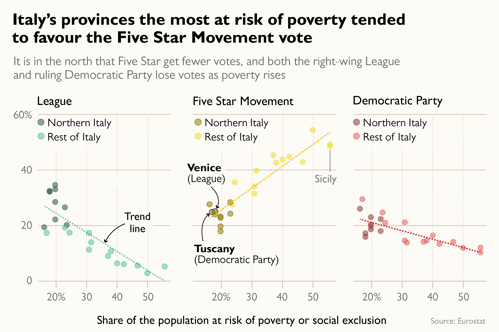
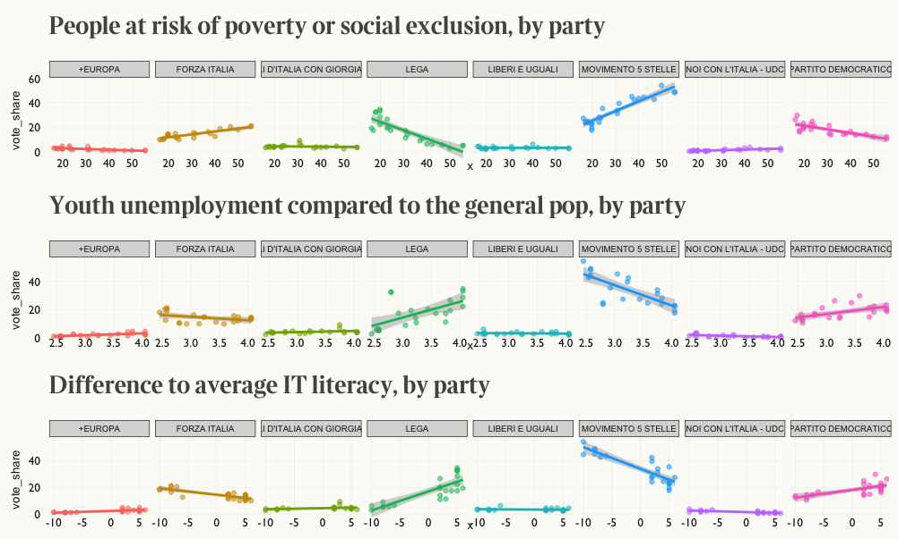
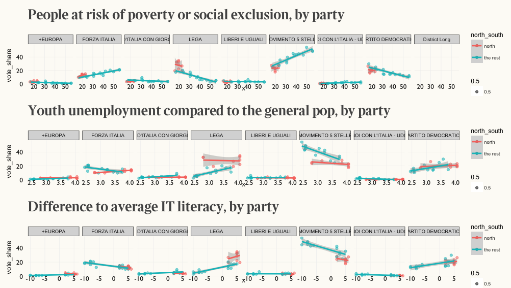

# 2018 Italian election data

This repository contains the data source and code needed to reproduce our [analysis of the 2018 Italian election results](https://www.thetimes.co.uk/article/italian-election-2018-results-and-analysis-xpddmqprl), as published in The Times 7th March 2018 edition.

## how to use and read

* `GatherData.R` will load all the required dependencies and data from CSV files in `/data`.  
Thematic data frames will be created for each studied variable (risk of poverty and social exclusion, IT literacy, youth unemployment, etc.). It will arrange all our plots on a single page and print out a `glance()` of the linear regressions we ran, so as to study how well our models fit the data.
* `NorthSouth.R` will run a similar analysis but will break down the country into north and south.

## note

The province-level data and plot have been commented out, since they haven't been matched with electoral results yet.
